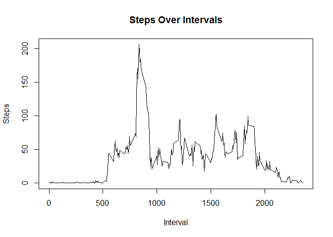

# PA_1

##Loading and preprocessing the data
The data is tidy and does not need to be processed.

##What is mean total number of steps taken per day?

```r
setwd("C:/RData")
data <- read.csv("activity.csv") 
stepsPerDay<-aggregate(steps~date,data,sum) #This aggregates the steps by total per day

hist(stepsPerDay$steps,main="Steps Per Day",xlab="Steps")
```

 

```r
meanSteps<-mean(stepsPerDay$steps)
medianSteps<-median(stepsPerDay$steps)
```
The mean is 1.0766 &times; 10<sup>4</sup>.
The meadian is 10765.

##What is the average daily activity pattern?

```r
averageData<-aggregate(steps~interval,data,mean)
plot(averageData$interval,averageData$steps,type="l",xlab="Interval", ylab="Steps",main="Steps Over Intervals")
```

 

```r
y<-max(averageData$steps)
averageMax<-averageData[averageData$steps==y,"interval"]
```


The 5 minute interval with the maximum average number of steps is 830- 835.

##Imputing missing values

```r
numberOfMissing<-sum(is.na(data$steps)) #Compute the total number of missing values

head(data)
```

```
##   steps       date interval
## 1    NA 2012-10-01        0
## 2    NA 2012-10-01        5
## 3    NA 2012-10-01       10
## 4    NA 2012-10-01       15
## 5    NA 2012-10-01       20
## 6    NA 2012-10-01       25
```

```r
#I subset the average steps per day by all the rows in the dataset that are NA by date under the column steps
data[is.na(data$steps),"steps"]<-stepsPerDay[data[is.na(data$steps),"date"],"steps"]
newdata<-data

head(newdata) #This is the dataset without the missing values
```

```
##   steps       date interval
## 1   126 2012-10-01        0
## 2   126 2012-10-01        5
## 3   126 2012-10-01       10
## 4   126 2012-10-01       15
## 5   126 2012-10-01       20
## 6   126 2012-10-01       25
```

```r
histogramOfSteps<-hist(newdata$steps,xlab="Steps",main="Steps Over Intervals")
```

 

```r
averageSteps<-mean(stepsPerDay$steps)
medianSteps2<-median(stepsPerDay$steps)

numberOfMissing2<-sum(is.na(newdata$steps))
```
The number of missing values is 2304.

I replaced the missing values with the mean steps per day. 

The number of missing values is now 288.

Feedback about how to reduce the number of missing values would be nice. 

The mean number of steps is 1.0766 &times; 10<sup>4</sup>.
The median number of steps is 10765.

Removing the missing values from the dataset did not impact the mean and median. The mean and median stayed the same.

##Are there differences in activity patterns between weekdays and weekends?


```r
daysOfWeek<-weekdays(as.Date(data$date)) ##Convert data variable into weekdays
dw<-function(x=c()){ ##Create a function that will create the factor variable
  r<-c()
  for (i in x) {
    if(i=="Saturday" || i=="Sunday"){
      r<-c("weekend",r)
    }
    else{
      r<-c("weekday",r)
    }
  }
 r<-as.factor(r) 
}

weekDay<-dw(daysOfWeek) #This is the factor variable

df<-data.frame(averageData,weekDay) #This is merged dataset of average steps per interval data and weekday 
str(df)
```

```
## 'data.frame':	17568 obs. of  3 variables:
##  $ interval: int  0 5 10 15 20 25 30 35 40 45 ...
##  $ steps   : num  1.717 0.3396 0.1321 0.1509 0.0755 ...
##  $ weekDay : Factor w/ 2 levels "weekday","weekend": 1 1 1 1 1 1 1 1 1 1 ...
```

```r
library("lattice")
```

```
## Warning: package 'lattice' was built under R version 3.1.1
```

```r
xyplot(steps~interval| weekDay, data=df,layout = c(1, 2),type="l")
```

 
